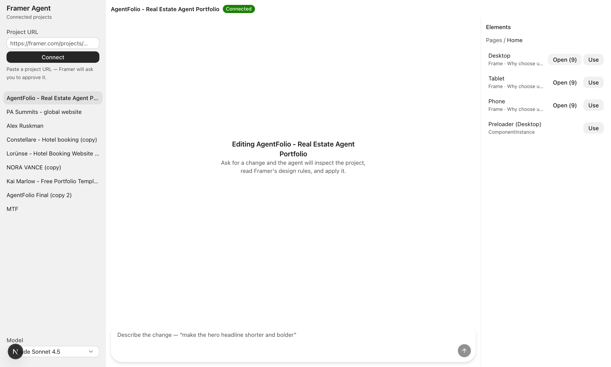

# Framer Agent Console

Connect your Framer projects, pick a layer, and edit it by prompting. Your OpenRouter model does the
work; the UI is built with [Astryx](https://github.com/facebook/astryx).



## Runs locally, not on Vercel

This app shells out to the `@framer/agent` CLI, which runs a relay server on `127.0.0.1:19988`
holding an authenticated connection to each Framer project, and reads credentials from
`~/.config/framer`. None of that exists on a serverless host, so the console is a local tool:

```bash
cp .env.example .env.local   # add OPENROUTER_API_KEY
npm run dev                  # http://localhost:3000
```

Every API route refuses non-localhost requests — they can execute code against your real projects.

## How it works

```
Console (localhost)
  ├─ /api/projects   list + authorize projects        →  framer project auth|list
  ├─ /api/session    bind a session to one project    →  framer session new
  ├─ /api/tree       walk the layer tree              →  framer.agent.serialize
  ├─ /api/selection  attach a layer + highlight it    →  framer.setSelection
  └─ /api/agent      the agent loop                   →  OpenRouter  ⇄  framer exec
```

The agent loop gives your model four tools: `framer_exec` (run JS against the live project),
`read_context` (Framer's own design guidance), `list_context`, and `framer_docs`. It runs up to 14
tool round-trips per message, streaming each step to the UI as NDJSON.

## Why it doesn't re-search every time

Locating a node is the slow part — finding one headline can take ten tool calls through nested
components. Two mechanisms stop that repeating.

**The transcript persists.** The full message list, tool calls and their results included, is kept
server-side per session in `src/lib/conversations.ts`. A follow-up like "now make it bolder"
continues from what the agent already found. (Before this, history was rebuilt from visible text
only, so every message started blind.) Trimming only ever cuts whole exchanges, so a `tool` message
is never orphaned from the assistant turn that called it.

**Findings persist across sessions.** The agent has `remember` and `forget` tools writing to
`.data/memory/<projectId>.json`, injected into its system prompt on every request. It's told to save
node ids, the path to them, and the snippet that worked, the moment it finds something.

Measured on a live project, asking for the Home hero headline:

| | Tool calls |
| --- | --- |
| Cold, empty memory | 10 |
| Same question, **brand new session** | **0** |

The note it wrote itself:

> `home.hero.headline` — Home page (/) hero headline: RichTextNode id `VAoiyCxFr`, tag h1, inside
> FrameNode "Slogan" `vSGmrZCT5` → "Hero Text Column" `sNkYD97wQ` → "Desktop Slide1" `YXc6gwPMw`,
> which lives in Hero ComponentNode `Yte5Pu12m`. Hero instance on page is `UZ0OqYzt8` (children
> don't serialize from instances — read via component scope).

The **Memory** panel lists these; `Clear` wipes them when the project has changed enough that old
findings would mislead.

## Connecting a project

Paste a project URL into the sidebar:

```
https://framer.com/projects/AgentFolio-Real-Estate-Agent-Portfolio--nIkZQ8gC90HC1a67OPsg-2p0kw
```

Framer opens a browser tab asking you to approve it. Bare project IDs and remix links work too.
Approved projects persist in `~/.config/framer/projects.json`, so they're there next time.

Selecting a project opens a session, which also regenerates ~250KB of project-specific guidance —
pages, components, CMS collections, styles, design tokens — under
`~/.claude/skills/framer/projects/<projectId>/`. The agent reads from it on demand rather than
carrying it all in every request.

## Picking an element

The **Elements** panel walks the project: pages → breakpoints → sections → layers. `Open` drills in,
`Use` attaches a layer to your next prompt.

Attaching does two things: it calls `framer.setSelection`, so the layer highlights in your open
Framer editor and you can confirm you targeted the right thing; and it puts the serialized layer
into the prompt as a `<selected-layer>` block, so the agent edits that node directly instead of
searching for it.

> **Note on clicking inside Framer:** the relay connects to the project *document*, not to your
> editor window, so it cannot read what you have selected in Framer — there is no `getSelection` on
> that channel. Selection travels one way: console → Framer. That's why picking happens here.

## Environment

| Variable | Required | Purpose |
| --- | --- | --- |
| `OPENROUTER_API_KEY` | yes | Server-side only. Never prefix with `NEXT_PUBLIC_`. |
| `AGENT_MAX_TOKENS` | no | Per-step reply cap. Default `8192`. Set `0` to remove it. |
| `AGENT_MAX_STEPS` | no | Tool round-trips per message. Default `20`. |
| `NEXT_PUBLIC_SITE_URL`, `SITE_NAME` | no | Sent to OpenRouter as `HTTP-Referer` / `X-Title`. |

### On `max_tokens`

OpenRouter reserves `max_tokens` against your balance **before** running the call. On a *paid* model
with a small balance, leaving it unset makes `gpt-4o` reserve its full 16k window and fail with a
`402` — that's the original reason for the cap.

On a zero-cost model like Ox Alpha there is nothing to reserve, so **you can drop it**:
`AGENT_MAX_TOKENS=0` omits the field entirely. The only thing the cap still buys you there is
protection from a runaway reply.

The default is `8192` rather than something small because edits are the expensive case: an
`applyChanges` payload for a whole section dwarfs a chat reply, and a cap that truncates it mid-JSON
fails the edit outright.

### On `ALLOWED_ORIGINS`

A CORS allowlist, and it applies **only to the chat widget** (`/api/chat`) — not the console. It
answers: which other websites' browsers may call that endpoint directly.

- Using the iframe embed (`/embed`)? The page and the API share an origin, so CORS never applies —
  **leave it empty**.
- Calling `/api/chat` straight from a Framer code component on your published site? That's a
  cross-origin request, so list that site:
  `ALLOWED_ORIGINS=https://yoursite.framer.website,https://yoursite.com`

Empty in production means same-origin only. Empty in development stays open, so a tunnel into the
Framer canvas works without extra config. The console's own routes ignore it entirely — they're
localhost-only, which is a stricter rule.

## Model choice

Editing is a tool-calling loop, so model quality matters more than it does for plain chat. Weaker
models guess method signatures and burn steps recovering. Presets live in `src/lib/models.ts`.

**Default is `stealth/ox-alpha`** — an unattributed model OpenRouter is previewing at $0 with a 1M
context and tool support. Verified here: an 11-tool-call run against a live project moved account
usage by exactly $0.00, on a key with zero credits. That means the console runs without funding it.

Two things to know before relying on it:

- **The free window is temporary.** Ox Alpha appeared around 20 Aug 2026 with a reported ~1 week
  preview. When it ends or the model is withdrawn, switch the sidebar to Claude Sonnet 4.5 — that
  path needs OpenRouter credits.
- **Stealth traffic is training/eval signal.** Your prompts and whatever the agent reads out of your
  Framer project go to an undisclosed lab. Fine for a portfolio site; not for client work under NDA.
  Use Sonnet for anything confidential.

## Safety

- Every route is localhost-only.
- Framer auto-branches edits, so changes land on a branch rather than your live site. The console
  surfaces a badge when that happens.
- The agent is instructed to confirm before deleting content or making unrequested changes — but it
  *is* editing your real project. Start on a copy if that matters.

## Also in here: a public chat widget

Separate from the console, `framer/ChatAgent.tsx` plus `/embed` and `/api/chat` are an
OpenRouter-backed chat widget you can drop onto a Framer *site* for your visitors. That part does
deploy to Vercel. Personas live in `src/lib/agents.ts`.

## Astryx

The UI uses Astryx's `Chat` primitives, `AppShell`, and `SideNav`. Its docs are available offline:

```bash
npx astryx component ChatComposer
npx astryx component --list
```
